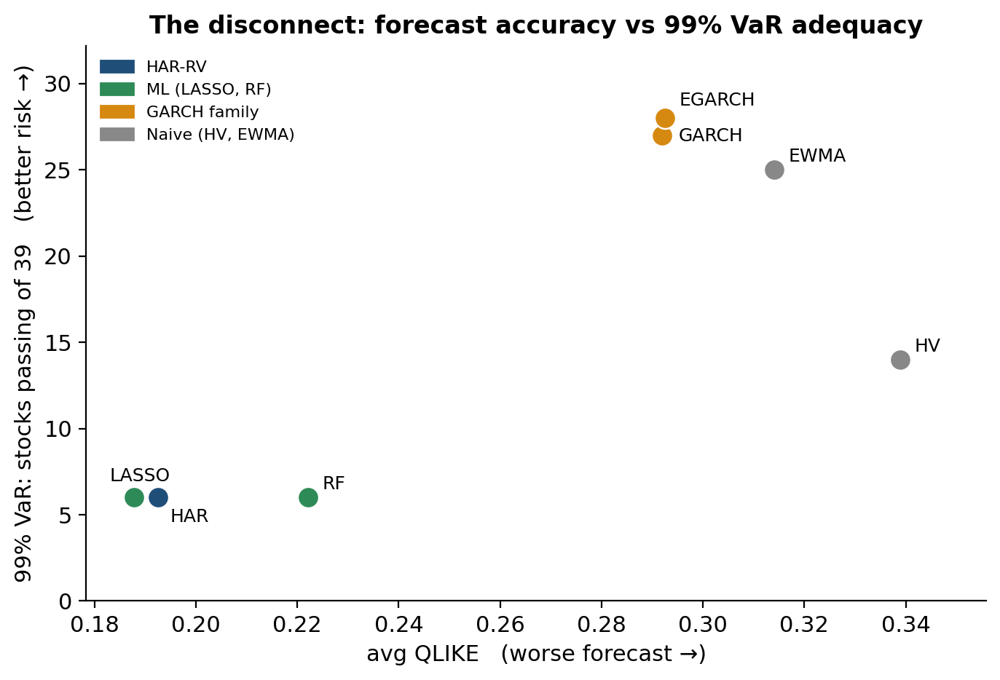
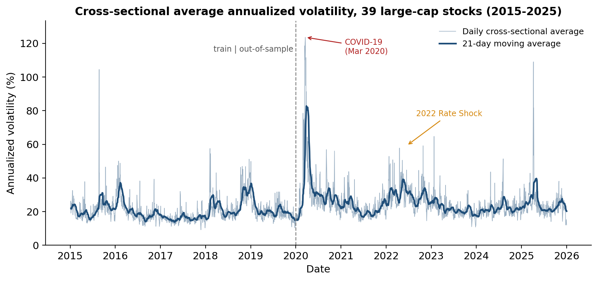
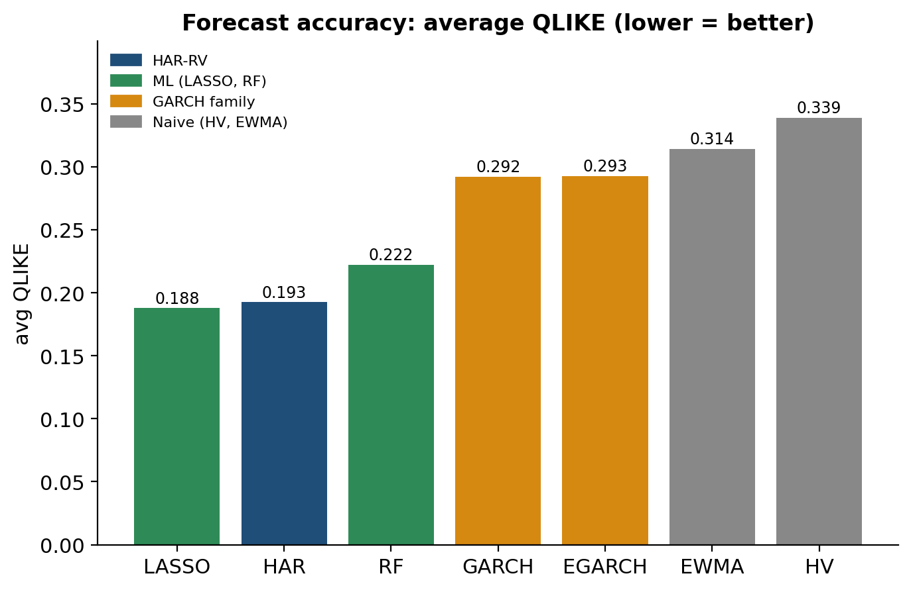
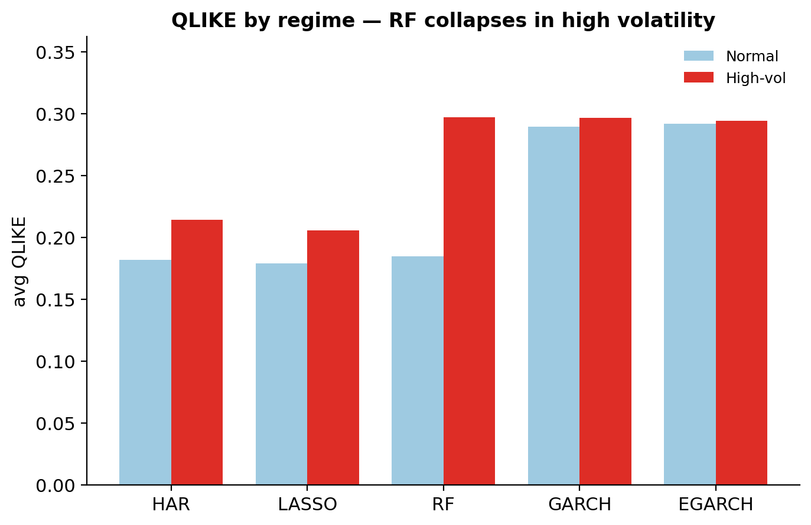

# Forecasting Stock Market Volatility: GARCH vs. HAR-RV vs. Machine Learning

**BSc thesis, Vrije Universiteit Amsterdam (Economics and Business Economics, Finance) · Grade 8.0/10**

The thesis compares econometric and machine-learning models on one-day-ahead volatility forecasts for 39 US large-cap stocks. It then tests whether a more accurate forecast also gives a more reliable Value-at-Risk.

## Key findings

| # | Hypothesis | Result |
|---|---|---|
| H1 | HAR-RV beats GARCH out-of-sample | **Supported.** HAR is significantly more accurate than GARCH on 38 of 39 stocks and than EGARCH on 37 of 39 (Diebold-Mariano, 5%). |
| H2 | ML does not uniformly beat HAR-RV | **Supported.** LASSO is the most accurate model overall (significantly better than HAR on 21 of 39 stocks and never significantly worse). Random Forest is less accurate than HAR. |
| H3 | ML does better in high-volatility regimes | **Mixed.** LASSO widens its lead over HAR in high-volatility periods (beats HAR on 35 of 39 stocks, Wilcoxon p < 0.001). Random Forest breaks down: during COVID-2020 its QLIKE is 2.5× HAR's. |
| H4 | Better forecasts do not always give better VaR | **Supported.** GARCH/EGARCH are among the least accurate forecasters but give the best-calibrated 99% VaR (27–28 of 39 stocks pass). HAR, LASSO and RF pass on only 6. At 95%, the ranking flips. |

The practical takeaway for risk management: **the model that forecasts volatility best is not the model that measures tail risk best.** Choosing a model on forecast loss alone can produce VaR that breaches far too often at 99%.



## Data

- **Source:** [VOLARE](http://volare.unime.it), realized measures computed from high-frequency data (Cipollini et al., 2026).
- **Universe:** 40 Dow 30 / S&P 100 stocks, 2015–2025. META is dropped because of a data break around its ticker change, which leaves **39 stocks**.
- **Target:** next-day 5-minute realized variance, `log(rv5_{t+1})`.
- **Split:** train 2015–2019, out-of-sample 2020–2025 (1,507 forecast days per stock, covering COVID-2020 and the 2022 rate shock).
- Prices are adjusted for 14 stock splits in `01_clean_prices.py`.

The data is not included in this repository. See [`data/README.md`](data/README.md) for how to download it.



## Models

| Model | Input | Estimation |
|---|---|---|
| HAR-RV (Corsi, 2009) | daily, weekly, monthly log RV | OLS, re-estimated daily |
| GARCH(1,1), EGARCH | daily returns | `arch`, re-estimated every 21 days |
| LASSO | HAR terms + lags, bipower variation, realized quarticity | `LassoCV`, standardised, refit every 21 days |
| Random Forest | same features as LASSO | 300 trees, out-of-bag residuals, refit every 21 days |
| HV, EWMA (λ = 0.94) | daily returns | naive floor |

All models use an expanding window and one-day-ahead forecasts, with no look-ahead. Log forecasts are mapped back to variance with a log-normal (Jensen) correction.

## Evaluation

- **Accuracy:** MSE and MAE on log RV, and QLIKE (robust to noise in the RV proxy).
- **Significance:** Diebold-Mariano tests against HAR, with Newey-West HAC errors and the Harvey-Leybourne-Newbold small-sample correction.
- **Regimes (H3):** each stock's high-volatility days are the top third by `rv5_t`, which is known at forecast time, so there is no selection on the outcome. Tested with a Wilcoxon signed-rank test.
- **Risk (H4):** 1-day VaR at 95% and 99% under normal and Student-t innovations, backtested with the Kupiec (unconditional coverage) and Christoffersen (conditional coverage) tests.

## Results

| Model | Avg QLIKE | HAR significantly better (of 39) | 99% VaR pass (of 39) | 95% VaR pass (of 39) |
|---|---|---|---|---|
| LASSO | **0.188** | 0 | 6 | **32** |
| HAR-RV | 0.193 | – | 6 | 30 |
| Random Forest | 0.222 | 2 | 6 | 31 |
| GARCH(1,1) | 0.292 | 38 | 27 | 19 |
| EGARCH | 0.293 | 37 | **28** | 17 |
| EWMA | 0.314 | 39 | 25 | 20 |
| HV | 0.339 | 39 | 14 | 27 |

VaR columns use Student-t innovations and the Christoffersen conditional-coverage test at 5%. Full tables are in [`results/tables/`](results/tables).

<p float="left">
  
  
</p>

## Repository structure

```
src/
  01_clean_prices.py             split adjustment, drop META  -> data/volare_clean.csv
  02_har_rv.py                   HAR-RV benchmark
  03_garch.py                    GARCH(1,1) and EGARCH
  04_ml_lasso_rf.py              LASSO and Random Forest
  05_naive_benchmarks.py         HV and EWMA
  06_diebold_mariano.py          DM tests vs HAR
  07_var_backtest.py             VaR + Kupiec / Christoffersen
  08_regime_analysis.py          high- vs normal-volatility regimes
  09_fig_volatility_overview.py  data figure
  10_fig_results.py              result figures
results/
  tables/                        summary and per-stock results (CSV)
  figures/                       figures used in the thesis
extras/
  rv5_proof_of_concept.py        computes RV5 from 5-minute Yahoo Finance data
```

## How to run

```bash
pip install -r requirements.txt
# put realized_variance_stocks.csv in data/ (see data/README.md)
python src/01_clean_prices.py
python src/02_har_rv.py
python src/03_garch.py
python src/04_ml_lasso_rf.py
python src/05_naive_benchmarks.py
python src/06_diebold_mariano.py
python src/07_var_backtest.py
python src/08_regime_analysis.py
python src/09_fig_volatility_overview.py
python src/10_fig_results.py
```

Run all scripts from the repository root. Daily forecasts are written to `results/forecasts/`. That folder is not tracked because the files are about 9 MB each. Steps 02–05 can run in any order; steps 06–10 need their output. Random Forest (step 04) is the slowest step.

## Author

Gleb Golovkin, MSc Finance student, Vrije Universiteit Amsterdam
